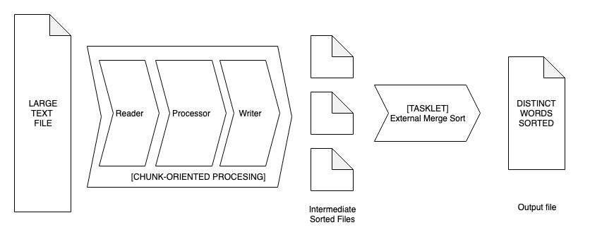
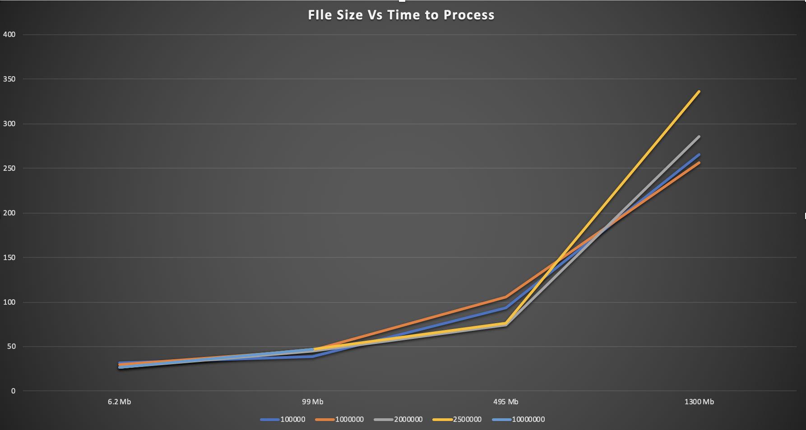
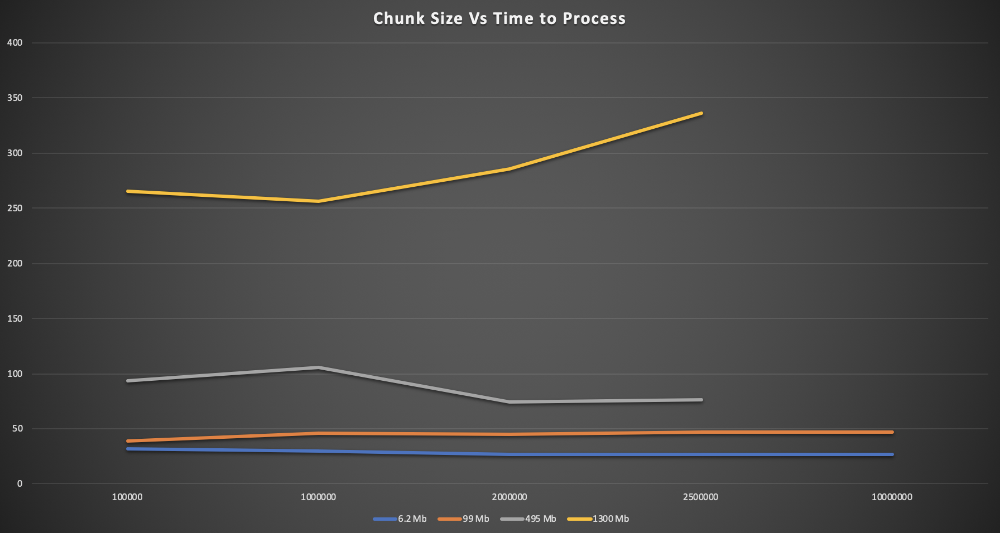

## Problem Statement

Given a very large text file that may not fit in available memory, create a file that contains the distinct words from the original file sorted in the ascending order.

## Usage

### Pre-req
- JDK 1.8
- Spring batch 4.0.0.RELEASE
- Lombok 1.16.8

### Configurable Paramaters
The following parameters can be configured (*in code*) in Config.java according to the specifications of the system.

- `CHUNK_SIZE_IN_TOTAL_LINES`: Number of lines at once to memory.

- `SOURCE_FILE_PATH`: Source file path.

- `DESTINATION_FILE_LOCATION`: Output file path. If provided directory doesn't exist, application will fail. 

- `DESTINATION_LOCATION`: Intermidiate file directory. If provided directory doesn't exist, application will fail.

### Command to Run

```
mkdir output
```
```
./mvnw clean spring-boot:run
```

## Assumptions
1. Input file is newline separated text file. 
2. Words in text are assumed to separated by either of the following characters: space, comma, full-stop, colon, semi-colon, quotes.
3. Content in input file is english text and expected to be sorted in english lexographical order.
4. Process have permission to write files in given location.
5. First line from all intermediate files can be placed in memory together.
6. All files in user-provided location for intermediate file will be processed.

## Design Goals
1. Large file processing robustness.
2. Code maintainability
3. Code Reusability
4. Scalability

## Algorithm and Data Flow Designing 

### First Cut 
In first cut, wrote a single threaded java program to read an text input file of memory containable size and process it to produce output file with list of all distinctly occuring words sorted aphabetically.

### Multi-threading feasibility
The solution has three core parts:

- Reading an input file content from disk.
- Processing the content.
- Writing an output file to disk.

Since the first and last steps are IO bound, it only makes sense to multi-thread the second step which is cpu-bound.
On the down side, threading would include extra processing overhead as well as extra complexity in the code for this assignment. 

*The care has been taken to write the application in such a way that it can be extended to multi-thread with few changes in code.*

### Framework: Spring Batch
Further research suggested Spring Batch framework could be a suitable candidate for developing large data volume processing application.

Rethinking the application algorithm:
- Reading an input file content from disk in *memory-fittable sized chunks*.
- Processing the chunk in memory to produce list of distinct words sorted alphabetically.
- Writing the processed chunks back to the disk as  intermediate files.
- Externally merge sort the intermediate files into one output file.


Spring Batch provides two types of job sementics which are very aligned with our algorithm.

#### Chunk Oriented Processing
This style of processing reads a chunk of data, processes it and write it out to persistent storage.

#### Tasklet Processing
This style of processing exposes execute method, which can be called multiple times until it returns FINISHED status. 

#### Spring Batch Data Flow Step Diagram



## Testing
The bottle-neck here is the first step of reading and processing the large input text. 
The second step of merging the intermediate file is reasonably assumed to be containable in memory.

Values for below plot is recorded for 4 files of different sizes. All the 4 files have the same content repeating but different order.

The largest file is of 28 million lines approx (1.3 GB in size) with same repetetive content as other. The aim here is to throttle the chunksize.

### File Size Vs Time to Process 



### Chunk Size Vs Time to Process



## Future Work And Known Issues
1. Multi-threading: In production environments, latest servers have hundreds of GB of RAM. Multi-threading the processing step can speed up the over all process.
2. The Processor in `Chunk oriented step` processes the given string, tokenize it to words and save them into a TreeSet. Later, Writer in `Chunk oriented step` has to merge those word for all the lines in a Chunk. Currently, the merge is done without utilizing the lareayd sorted word in Treeset. This could imporve a little bit of performance.
3. Consolidate Error handling
4. Add unit tests
5. Better file system resource handling: Right now, the output and intermediate file directories must exist, otherwise, the program will fail.
